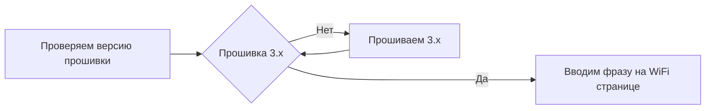

# Сверяем версию прошивок:

## Проверяем версию прошивки передатчика:

Потребуется [Lua скрипт ELRS](https://github.com/ExpressLRS/ExpressLRS/blob/3.x.x-maintenance/src/lua/elrsV3.lua?raw=true) (правой кнопкой, сохранить как *.lua). Скачайте и закиньте на флешку аппы, в папку `/Scripts/Tools`.
Чтобы открыть скрипт на аппаратуре зажмите кпопку `SYS` и выберите `ExpressLRS`.

<figure markdown>

</figure>

Если скрипт не открывается и висит на `Loading...`, проверь что в модели выставлен Internal CRSF для внутреннего передатчика, либо External CRSF для внешнего. [Настройка аппаратуры](/Manuals/Firmware/Transmitters/tx-prep)

<figure markdown>

</figure>

Листаем скрипт в самый низ и смотрим версию.

## Если ваш передатчик имеет версию 3.x.x 

Переходим в Lua Script ELRS, выбираем пункт `Wifi Connectivity` в скрипте, а потом нажмите `Enable Wifi`. Нажмите ОК еще раз, чтобы включить WiFI на передатчике. Подключитесь к сети `ExpressLRS TX` с паролем `expresslrs`.

<figure markdown>

</figure>

<figure markdown>

</figure>

!!! danger "Регион прошивки"
    Обратите внимание на регион прошивки, он должен совпадать и на приемнике и на передатчике и быть ISM2G4, в редком случае вам может приехать из магазина EU/LBT версия, имеющая ограничения, тогда придется перепрошить.

В поле ``Binding Phrase`` вводим уникальное слово и нажимаем сохранить. По этому слову приемник будет находить передатчик. Никаких дополнительных процедур для бинда не требуется, все автоматически.
Пожалуйста не вбивайте 123456 и тд, судя по ELRS чату таких людей очень много, и когда-нибудь такие ленивые люди пересекуться на полетушках и будут биндится друг к другу.

<figure markdown>
{ width="300" }
</figure>

## Если ваш передатчик имеет версию 2.x.x 

Прошиваем на ``3.x.x`` прошивку по инструкциям:

[Инструция прошивки внутреннего передатчика](/Manuals/Firmware/Transmitters/Flashing-internal-tx)

[Инструция прошивки внешнего передатчика](/Manuals/Firmware/Transmitters/Flashing-external-tx)

## Проверяем версию прошивки приемника:

Если у вас встроенный в полетник SPI приемник то вам в [эту инструцию](/Manuals/Firmware/Recievers/spi-reciever)

Подайте питание на полетник. Это можно сделать как по USB, так и воткнув батарею в дрон. Диод на приемнике начнет медленно мигать. Через 20-30 секунд диод на приемнике начнет моргать быстро, значит он начал раздавать WiFi.

<figure markdown>

</figure>

Подключитесь к сети `ExpressLRS RX` с паролем `expresslrs`.

<figure markdown>

</figure>

Откройте браузер и перейдите на http://10.0.0.1/
Версия прошивки указана в шапке сайта

## Если вы видите версию 3.x.x

!!! danger "Регион прошивки"
    Обратите внимание на регион прошивки, он должен совпадать и на приемнике и на передатчике и быть ISM2G4, в редком случае вам может приехать из магазина EU/LBT версия, имеющая ограничения, тогда придется перепрошить.

В поле ``Binding Phrase`` вводим уникальное слово и нажимаем сохранить. По этому слову приемник будет находить передатчик. Никаких дополнительных процедур для бинда не требуется, все автоматически.
Пожалуйста не вбивайте 123456 и тд, судя по ELRS чату таких людей очень много, и когда-нибудь такие ленивые люди пересекуться на полетушках и будут биндится друг к другу.

<figure markdown>
{ width="300" }
</figure>

## Если вы видите версию 2.х.х

Прошейте приемник до 3.х.х [по инструкции](/Manuals/Firmware/Recievers/external-reciever)

